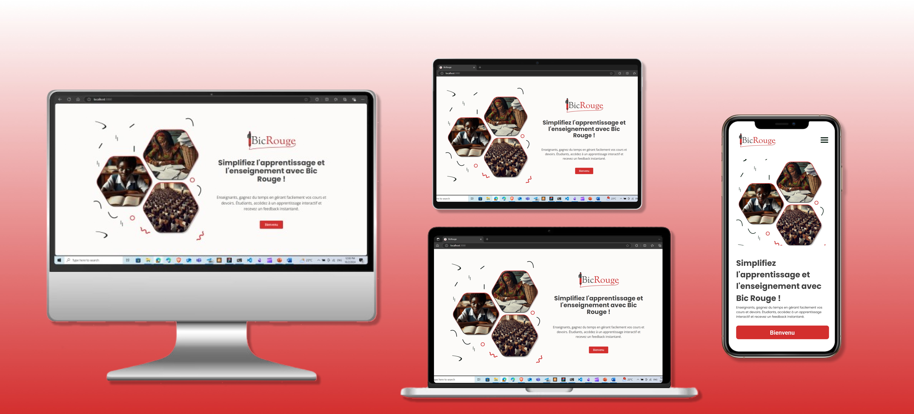

# Bic Rouge an LLM Assignment Grading and Feedback Generation System

This project is a Large Language Learning Model (LLM) based assignment grading and feedback application designed to support teachers. It uses a combination of Python with FastAPI for the backend, Vite for the frontend, and LLAMA-2 and GPT-3.5 Turbo for the LLM. Additionally, it includes a mobile app built with Flutter.

## Tech Stack

- **Backend**: Python with FastAPI
- **Frontend**: Javascript with React.js and Tailwind
- **Mobile**: Flutter
- **LLM**: GPT-3.5 Turbo and LLAMA-3 8B instruct models

## Design



## Architecture


## Deployment

The prototype will be deployed using platforms like Vercel or Netlify for the frontend and AWS S3 or Azure, leveraging Docker containers and CI/CD using GitHub Actions.

## Features

- **Assignment Scoring**: The application uses LLM to score assignments based on predefined criteria.
- **Feedback Generation**: It also generates feedback for each assignment, providing students with valuable insights into their performance.
- **Teacher Support**: The application is designed to reduce the workload of teachers by automating the scoring and feedback process.

## Getting Started

To get a local copy up and running, follow these steps:

### Backend (FastAPI)

1. Clone the repo

   ```sh
   git clone git@github.com:Ashuza11/AI_Project_BicRouge.git

   ```

2. Navigate to the backend directory

   ```sh
   cd BicRouge-Web/backend

   ```

3. Create a virtual environment

   ```sh
   python -m venv env

   ```

4. Activate the virtual environment

   - On Windows:

   ```sh
   .\env\Scripts\activate
   ```

   - On macOS/Linux

   ```sh
   .\env\Scripts\activate

   ```

5. Install the required packages

   ```sh
   pip install -r requirements.txt

   ```

6. Add your API keys in the `.env` file

   ```sh
      SECRET_KEY=your_secret_key
      OPENAI_API_KEY=your_openai_api_key
   ```

7. Run the FastAPI server

   ```sh
   uvicorn app.main:app --reload

   ```

### Frontend (React with Vite and Tailwind)

1. Navigate to the frontend directory

   ```sh
   cd BicRouge-Web/frontend

   ```

2. Install NPM packages

   ```sh
   npm install

   ```

3. Run the app

   ```sh
   npm run dev

   ```

### Mobile (Flutter)

1. Ensure you have Flutter installed. Follow the instructions [here](https://docs.flutter.dev/get-started/install) if you don't have it installed.

2. Navigate to the mobile app directory

   ```sh
   cd BicRouge-Mobile

   ```

3. Get the Flutter packages

   ```sh
   flutter pub get

   ```

4. Run the app

   ```sh
   flutter run

   ```

## Contributing

1. Fork the Project
2. Create your Feature Branch (`git checkout -b feature/AmazingFeature`)
3. Commit your Changes (`git commit -m 'Add some AmazingFeature'`)
4. Push to the Branch (`git push origin feature/AmazingFeature`)
5. Open a Pull Request

## License

Distributed under the MIT License. See `LICENSE` for more information.

## Contact

Muhigiri Ashuza @Team-maarifa - ashuzamh@gmail.com
